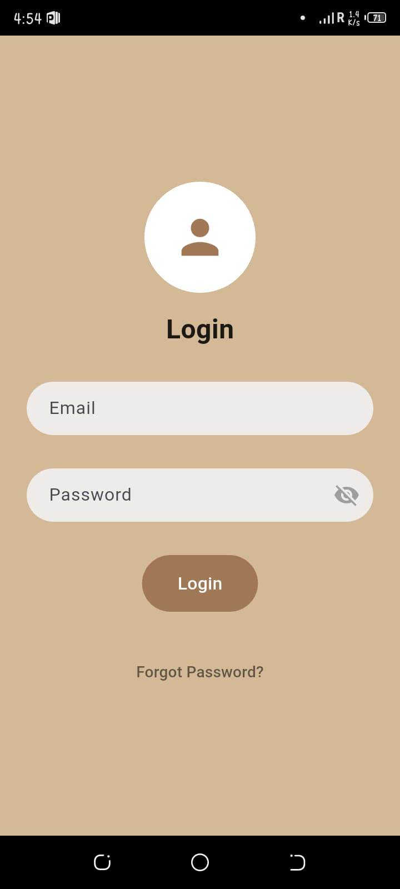
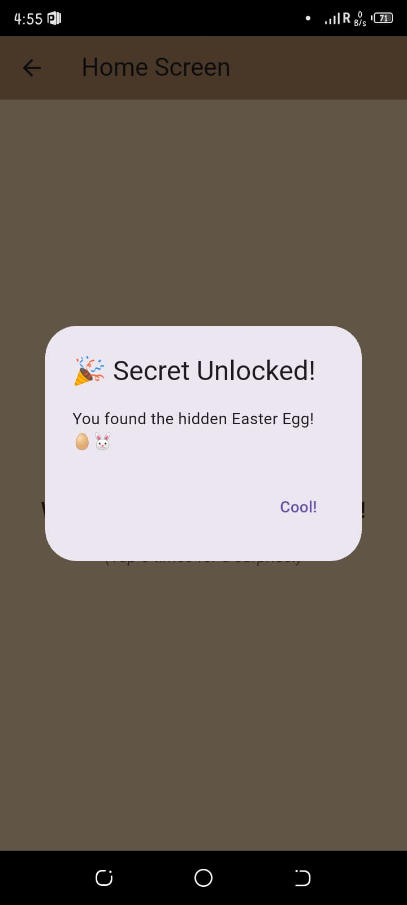

# Flutter Internship Week 1: Basic Flutter Development and UI Building

**A simple Flutter app demonstrating fundamental Flutter concepts including UI design, navigation, and form validation.**


## Introduction

This Flutter project marks the first week of my internship journey, focusing on understanding Flutter's basic structure and building a user-friendly login interface. The app provides a seamless experience by validating user inputs and navigating between screens efficiently.


## Features
- Login screen with email and password fields.  
- Real-time validation of email format and password strength.  
- Validation errors displayed immediately below the input fields in red.  
- Smart greeting message on login based on current time (e.g., “Good Morning,” “Good Afternoon,” or “Good Evening”) along with a welcome message showing the user’s email.  
- "Forgot Password?" link (placeholder).  
- Navigation from Login screen to Home screen using `Navigator.push()`.  
- Easter Egg: Tap the Home screen 5 times rapidly to reveal a surprise message or animation.  
- Clean and responsive UI layout using basic Flutter widgets (Column, Row, Container).

## Technology Stack

* Flutter
* Dart
* Flutter SDK (Environment set up using Android Studio or VS Code)

## Installation & Setup

Follow the steps below to run the app locally on your machine:

1. **Clone the repository**

```bash
git clone https://github.com/sajeelailyas/flutter-internship-week1.git
```

2. **Navigate into the project directory**

```bash
cd flutter-internship-week1
```

3. **Install dependencies**

```bash
flutter pub get
```

4. **Run the app**

```bash
flutter run
```

*Make sure you have Flutter SDK installed and an emulator or physical device connected.*


## Usage

- Launch the app.
- Enter a valid email address and a strong password.
- Observe real-time validation messages if input is invalid.
- After successful login, see a personalized welcome message with a time-based greeting.
- On the Home screen, tap anywhere 5 times quickly to unlock a fun surprise.
- Use the "Forgot Password?" link for future recovery features.


## Screenshots

### 🔐 Login Screen  


### 🏠 Home Screen (With Easter Egg)  



*This project was developed during a Flutter internship as a learning exercise.*
